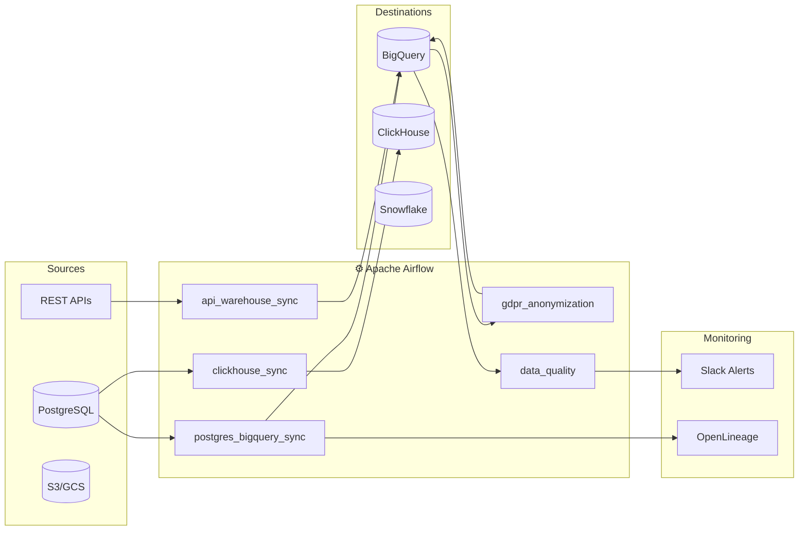

# Airflow Data Engineering Pipelines

A collection of production-grade Apache Airflow DAGs demonstrating real-world data engineering patterns. Each project showcases battle-tested solutions for common ETL challenges.

## 📸 Airflow DAGs


## 🏗️ Architecture



## 🎯 Projects Overview

### ETL Pipelines

| Project | Description | Key Patterns |
|---------|-------------|--------------|
| [**postgres_bigquery_sync**](./postgres_bigquery_sync/) | Sync large tables from PostgreSQL to BigQuery | Chunked processing, resumable state, gap detection |
| [**api_warehouse_sync**](./api_warehouse_sync/) | Sync data from REST APIs to data warehouse | Pagination, currency conversion, atomic table swap |
| [**gdpr_anonymization**](./gdpr_anonymization/) | GDPR-compliant data anonymization | Faker integration, batch updates, multi-dataset |
| [**ecommerce_analytics**](./ecommerce_analytics/) | E-commerce metrics aggregation | Gap filling, rolling windows, TaskFlow API |
| [**monthly_snapshots**](./monthly_snapshots/) | Monthly aggregations with MERGE | UPSERT pattern, staging tables, idempotent updates |
| [**clickhouse_sync**](./clickhouse_sync/) | Postgres to ClickHouse for OLAP | DataFrame batching, columnar DB, 10-100x faster queries |

### Operations & Governance

| Project | Description | Key Patterns |
|---------|-------------|--------------|
| [**data_quality**](./data_quality/) | Automated data quality validation | Great Expectations, schema/value checks, freshness |
| [**alerting**](./alerting/) | Slack & email notifications | Custom callbacks, rich messages, escalation |
| [**backfill_manager**](./backfill_manager/) | Controlled backfill operations | Parameterized DAGs, dry-run mode, chunked processing |
| [**data_lineage**](./data_lineage/) | OpenLineage integration | Column-level lineage, Marquez visualization |

### Infrastructure

| Component | Description |
|-----------|-------------|
| [**docker/**](./docker/) | Local Airflow environment with Docker Compose |
| [**terraform/**](./terraform/) | GCP infrastructure as code (BigQuery, Composer, IAM) |
| [**.github/workflows/**](./.github/workflows/) | CI/CD pipeline for DAG testing |
| [**tests/**](./tests/) | Unit tests for custom operators |

## 🏗️ Architecture Patterns

### 1. Chunked Processing with Sync Control

Handle large tables without memory issues or timeouts:

```python
CHUNK_SIZE = 250000

while True:
    rows = fetch_chunk(last_id, CHUNK_SIZE)
    if not rows:
        sync_control.mark_as_finished(current_date)
        break
    
    insert_to_warehouse(rows)
    sync_control.update_progress(current_date, max(r.id for r in rows))
```

**Benefits:**
- ✅ Survives failures (resumable from last chunk)
- ✅ Memory efficient (process 250K rows at a time)
- ✅ Observable (track progress in sync_control table)

### 2. Atomic Table Swap

Zero-downtime data refreshes:

```sql
BEGIN TRANSACTION;
  DROP TABLE IF EXISTS target_old;
  ALTER TABLE target RENAME TO target_old;
  ALTER TABLE target_tmp RENAME TO target;
  DROP TABLE IF EXISTS target_old;
COMMIT;
```

**Benefits:**
- ✅ No downtime during updates
- ✅ Consistent data snapshot
- ✅ Easy rollback if needed

### 3. Gap Detection & Filling

Ensure continuous time series for analytics:

```python
def fill_date_gaps(data, start_date, end_date):
    existing_dates = {row.date for row in data}
    current = start_date
    
    while current <= end_date:
        if current not in existing_dates:
            data.append(Row(date=current, value=0))
        current += timedelta(days=1)
    
    return sorted(data, key=lambda r: r.date)
```

**Benefits:**
- ✅ No gaps in time series
- ✅ Accurate rolling calculations
- ✅ Clean visualization data

### 4. Batch UPDATE with Temp Table

Efficient bulk updates (GDPR anonymization, data corrections):

```sql
-- Create mapping table
CREATE TEMP TABLE mappings (id INT, new_value STRING);
INSERT INTO mappings VALUES ...

-- Single UPDATE with JOIN
UPDATE target t
SET t.field = m.new_value
FROM mappings m
WHERE t.id = m.id;
```

**Benefits:**
- ✅ Single UPDATE instead of N updates
- ✅ Atomic operation
- ✅ Much faster for large datasets

### 5. MERGE (Upsert) Pattern

Idempotent monthly aggregations:

```sql
MERGE target_table T
USING staging_table S
ON T.year_month = S.year_month AND T.account_id = S.account_id

WHEN MATCHED THEN UPDATE SET
    total = S.total,
    updated_at = CURRENT_TIMESTAMP()

WHEN NOT MATCHED THEN INSERT (year_month, account_id, total)
    VALUES (S.year_month, S.account_id, S.total)
```

**Benefits:**
- ✅ Safe to re-run (no duplicates)
- ✅ Handles late-arriving data
- ✅ Atomic update + insert

### 6. Multi-Database Architecture (OLTP → OLAP)

Postgres for transactions, ClickHouse for analytics:

```
PostgreSQL (OLTP)          ClickHouse (OLAP)
┌──────────────┐           ┌──────────────┐
│ Row-based    │   Sync    │ Columnar     │
│ ACID         │ ───────▶  │ 10-100x faster│
│ Transactions │           │ Analytics    │
└──────────────┘           └──────────────┘
```

**Benefits:**
- ✅ Right tool for each job
- ✅ Massive query speedup for analytics
- ✅ Efficient storage compression

## 📁 Project Structure

```
airflow_pipelines/
├── README.md                       # This file
├── requirements.txt                # Python dependencies
│
│ # ETL Pipelines
├── postgres_bigquery_sync/         # Database-to-warehouse sync
├── api_warehouse_sync/             # API-to-warehouse sync
├── gdpr_anonymization/             # GDPR compliance
├── ecommerce_analytics/            # Analytics aggregation
├── monthly_snapshots/              # MERGE pattern
├── clickhouse_sync/                # OLAP analytics
│
│ # Operations & Governance
├── data_quality/                   # Data quality checks
├── alerting/                       # Slack/email notifications
├── backfill_manager/               # Parameterized backfills
├── data_lineage/                   # OpenLineage integration
│
│ # Infrastructure
├── docker/                         # Local development environment
│   ├── docker-compose.yml
│   └── init-scripts/
├── terraform/                      # GCP infrastructure
│   ├── main.tf
│   └── variables.tf
├── .github/workflows/              # CI/CD pipelines
│   └── test-dags.yml
├── scripts/                        # Testing scripts
│   ├── test_dag_imports.py
│   └── test_dag_integrity.py
└── tests/                          # Unit tests
    └── test_sync_control.py
```

## 🚀 Quick Start

### Option 1: Docker (Recommended)

```bash
cd docker
docker-compose up -d

# Access Airflow UI at http://localhost:8080
# Username: admin, Password: admin
```

### Option 2: Manual Setup

```bash
# Install dependencies
pip install -r requirements.txt

# Initialize Airflow
airflow db init
airflow users create --username admin --password admin --role Admin --email admin@example.com

# Copy DAGs
cp -r */dags/* $AIRFLOW_HOME/dags/
```

### Option 3: Terraform (GCP)

```bash
cd terraform
cp terraform.tfvars.example terraform.tfvars
# Edit terraform.tfvars with your project ID
terraform init && terraform apply
```

## 🔧 Configuration

### Airflow Connections

```bash
# PostgreSQL source
airflow connections add 'postgres_default' \
    --conn-type 'postgres' \
    --conn-host 'localhost' \
    --conn-login 'user' \
    --conn-password 'pass' \
    --conn-schema 'mydb'

# BigQuery
airflow connections add 'google_cloud_default' \
    --conn-type 'google_cloud_platform' \
    --conn-extra '{"key_path": "/path/to/service-account.json"}'

# Slack alerts
airflow connections add 'slack_webhook' \
    --conn-type 'http' \
    --conn-host 'https://hooks.slack.com/services' \
    --conn-password '/YOUR/WEBHOOK/URL'
```

## 📊 Monitoring

### Sync Control Dashboard Query

```sql
SELECT 
    table_name,
    DATE(sync_date) as date,
    is_finished,
    last_max_id,
    synced_at
FROM sync_control
WHERE synced_at >= DATE_SUB(CURRENT_DATE(), INTERVAL 7 DAY)
ORDER BY synced_at DESC;
```

### Pipeline Health Check

```sql
-- Find stalled syncs (started but not finished)
SELECT *
FROM sync_control
WHERE is_finished = FALSE
  AND synced_at < TIMESTAMP_SUB(CURRENT_TIMESTAMP(), INTERVAL 24 HOUR);
```

## 🧪 Testing

### CI/CD Pipeline

Tests run automatically on every push via GitHub Actions:

```yaml
# .github/workflows/test-dags.yml
- Lint (flake8, black)
- DAG import validation
- DAG integrity checks
- Unit tests with pytest
```

### Local Testing

```bash
# Run all tests
pytest tests/ -v

# Test DAG imports
python scripts/test_dag_imports.py

# Test DAG integrity
python scripts/test_dag_integrity.py
```

### Mock Clients

```python
from includes.api_client import MockAffiliateAPIClient

client = MockAffiliateAPIClient()
partners = client.get_partners()
assert len(partners) == 100
```

## 📚 Learning Resources

- [Apache Airflow Best Practices](https://airflow.apache.org/docs/apache-airflow/stable/best-practices.html)
- [BigQuery ETL Patterns](https://cloud.google.com/bigquery/docs/loading-data)
- [OpenLineage Documentation](https://openlineage.io/docs/)
- [GDPR Data Handling Guidelines](https://gdpr.eu/right-to-be-forgotten/)

## 🤝 Contributing

1. Fork the repository
2. Create a feature branch
3. Add tests for new patterns
4. Submit a pull request

## 📄 License

MIT License - feel free to use these patterns in your projects!

---

Built with ❤️ by [Maksim](https://github.com/makuzminets) | Data Engineering Portfolio
