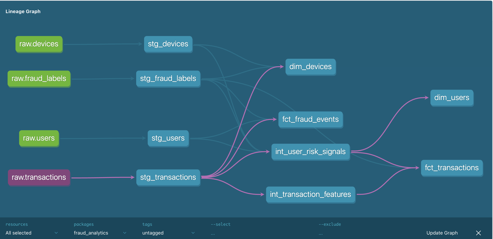
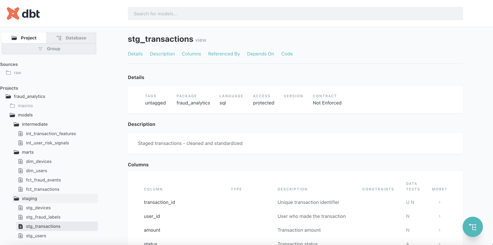

# 🛡️ Fraud Analytics dbt Project

A production-ready dbt project for fraud detection and risk analytics. Demonstrates data modeling best practices for Trust & Safety teams.

## 📸 Lineage Graph



## 📊 Models Overview



## 📊 Project Overview

This project transforms raw transaction and user data into analytics-ready models for:
- **Fraud Detection** — identifying suspicious patterns
- **Risk Scoring** — user and transaction risk signals
- **Monitoring** — real-time fraud metrics and KPIs

## 🏗️ Architecture

```
Raw Data → Staging → Intermediate → Marts → BI/Analytics
```

### Data Flow

```
sources/
├── raw_transactions      → stg_transactions      → int_transaction_features  → fct_transactions
├── raw_users             → stg_users             → int_user_risk_signals     → dim_users
├── raw_devices           → stg_devices           →                           → dim_devices
└── raw_fraud_labels      → stg_fraud_labels      →                           → fct_fraud_events
```

## 📁 Project Structure

```
dbt_fraud_analytics/
├── models/
│   ├── staging/           # Clean raw data, 1:1 with sources
│   │   ├── stg_transactions.sql
│   │   ├── stg_users.sql
│   │   ├── stg_devices.sql
│   │   └── stg_fraud_labels.sql
│   ├── intermediate/      # Business logic, joins, features
│   │   ├── int_transaction_features.sql
│   │   └── int_user_risk_signals.sql
│   └── marts/             # Final tables for analytics
│       ├── fct_transactions.sql
│       ├── fct_fraud_events.sql
│       ├── dim_users.sql
│       └── dim_devices.sql
├── tests/                 # Custom data tests
├── macros/                # Reusable SQL snippets
├── seeds/                 # Static reference data
└── dbt_project.yml        # Project configuration
```

## 🎯 Key Models

### Staging Layer (`stg_`)
Clean, typed, renamed columns from raw sources.

### Intermediate Layer (`int_`)
- `int_transaction_features` — transaction velocity, amount patterns, time features
- `int_user_risk_signals` — account age, device fingerprint, behavior signals

### Marts Layer (`fct_`, `dim_`)
- `fct_transactions` — enriched transactions with risk scores
- `fct_fraud_events` — confirmed fraud cases for analysis
- `dim_users` — user attributes and risk profile
- `dim_devices` — device fingerprints and trust scores

## 🧪 Testing Strategy

| Test Type | Examples |
|-----------|----------|
| **unique** | transaction_id, user_id |
| **not_null** | critical fields |
| **accepted_values** | status, fraud_type |
| **relationships** | foreign keys between models |
| **custom** | business rules (e.g., amount > 0) |

## 🚀 Usage

```bash
# Install dependencies
dbt deps

# Run all models
dbt run

# Test all models
dbt test

# Generate documentation
dbt docs generate
dbt docs serve
```

## 📈 Sample Metrics

| Metric | Description |
|--------|-------------|
| `fraud_rate` | % of transactions flagged as fraud |
| `chargeback_rate` | % of transactions with chargebacks |
| `false_positive_rate` | % of legitimate transactions blocked |
| `detection_rate` | % of fraud caught by rules/ML |

## 🛠️ Tech Stack

- **dbt** — data transformation
- **BigQuery / Snowflake** — data warehouse
- **Airflow** — orchestration (DAGs)
- **Looker** — BI layer

## 👤 Author

**Maksim Kuzminets**  
Fraud & Trust & Safety Analyst | 10+ years experience  
[LinkedIn](https://www.linkedin.com/in/maxkuzminets)

---

*This project demonstrates dbt best practices for fraud analytics use cases.*
