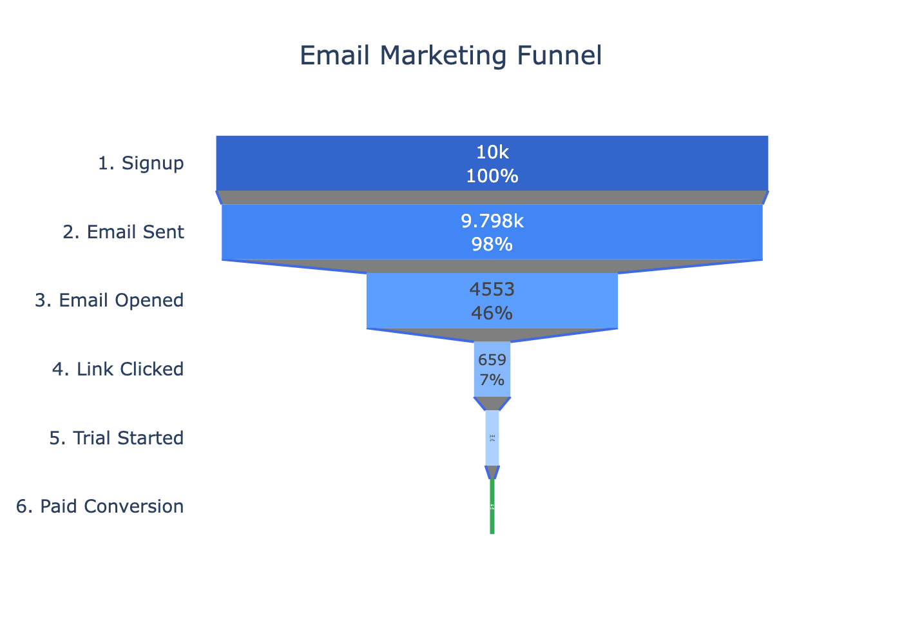
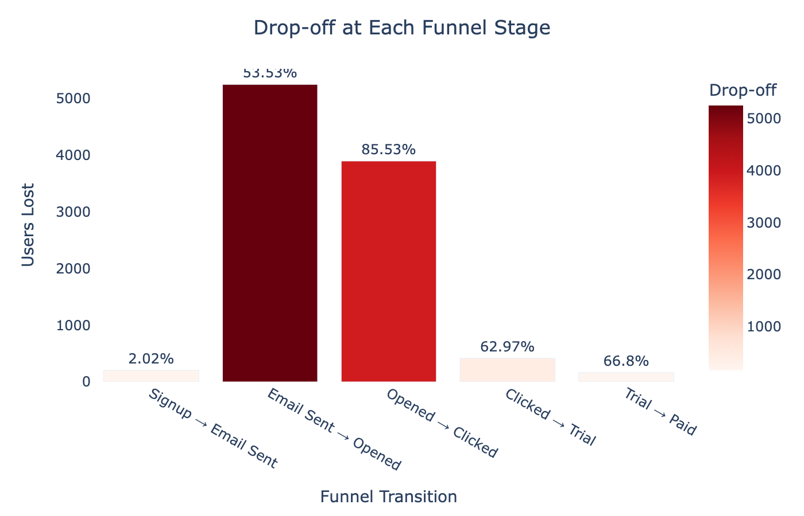
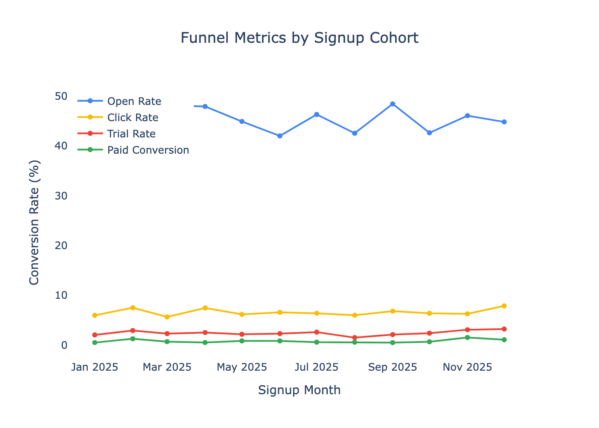
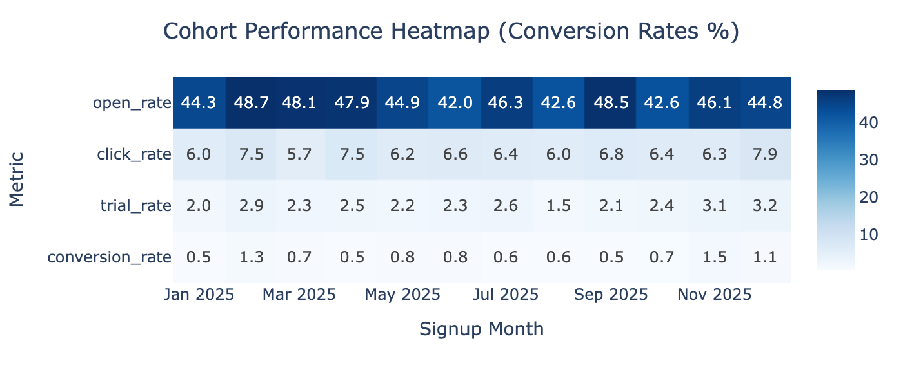
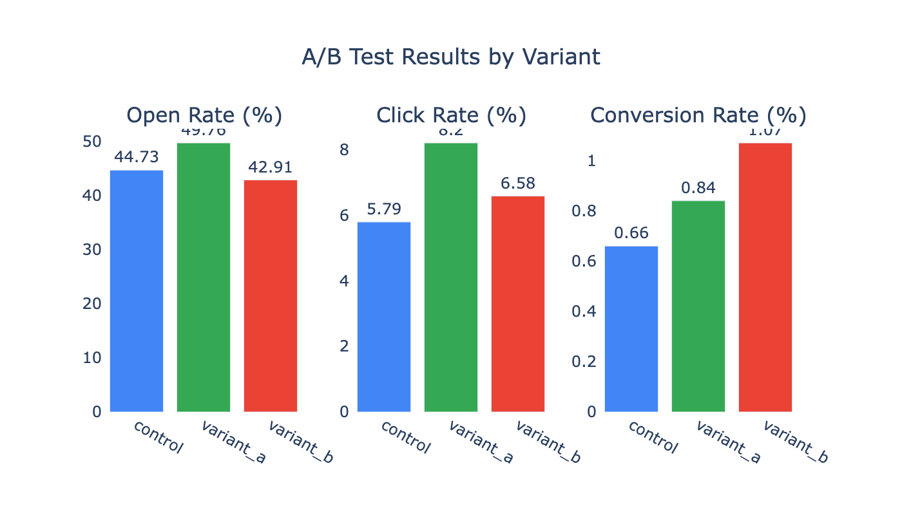
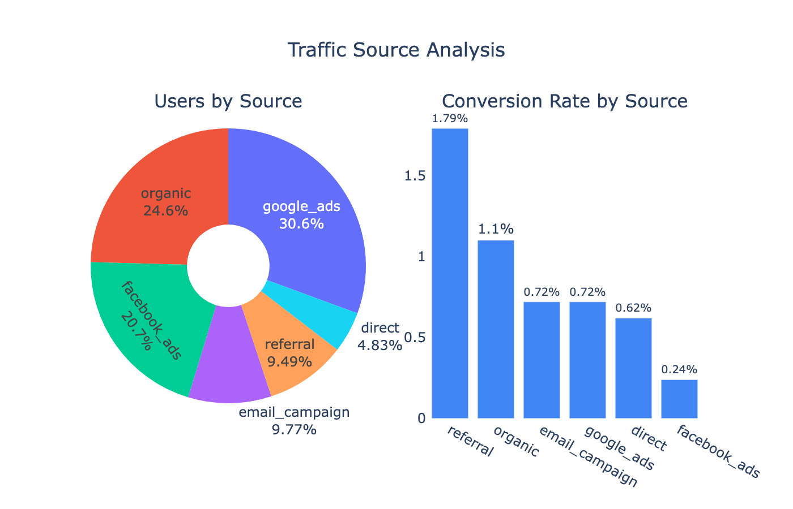
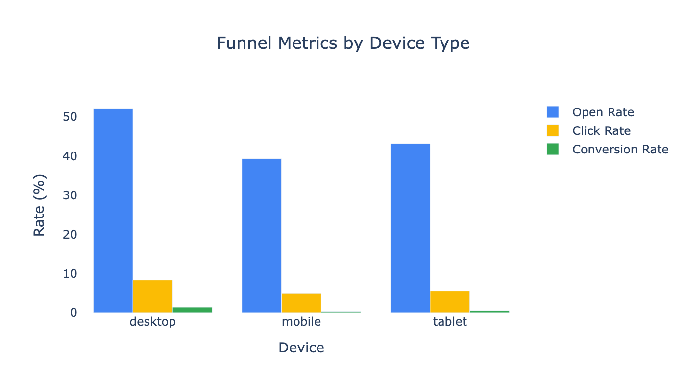
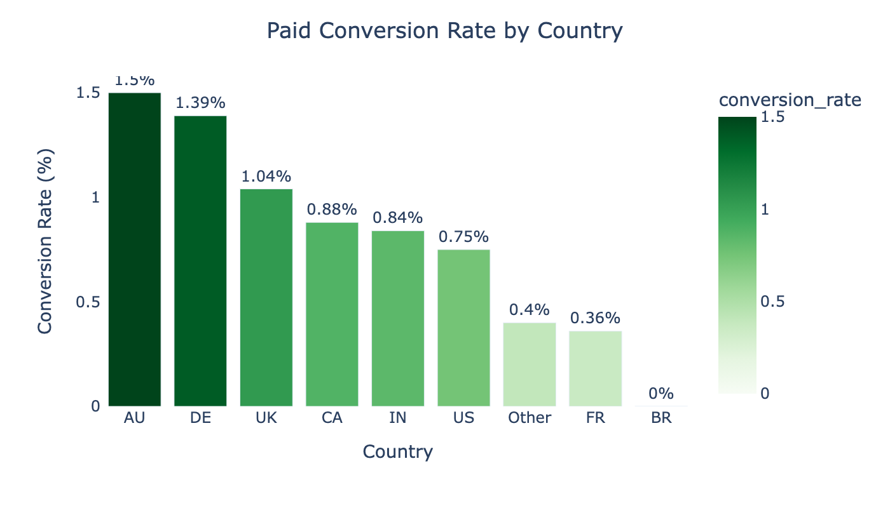
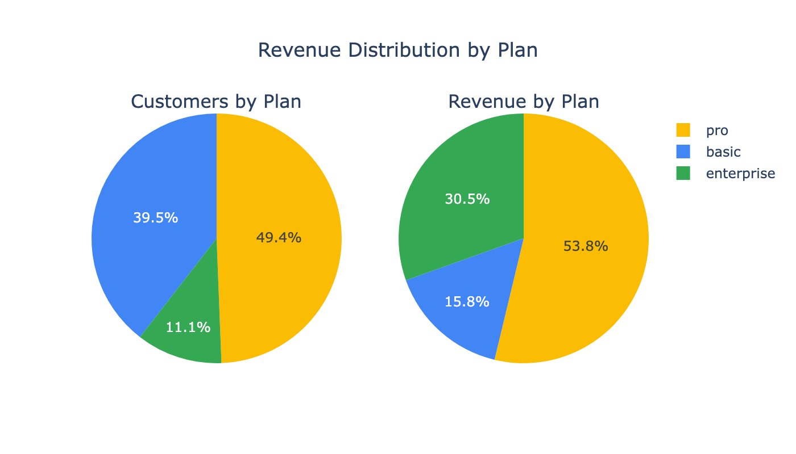
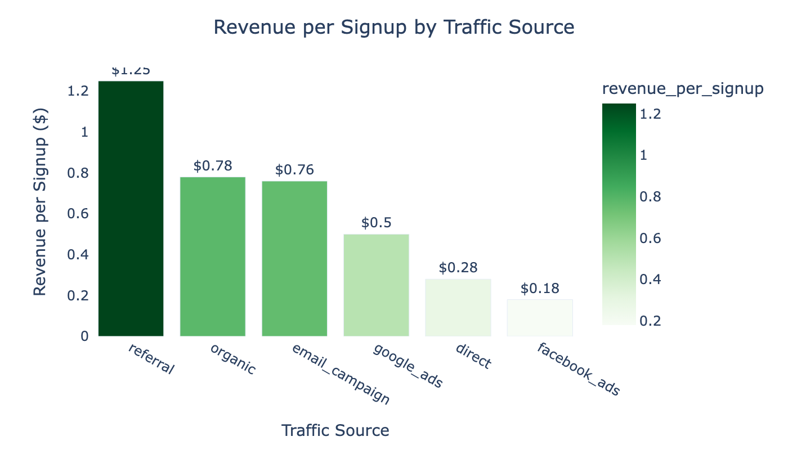

# Email Funnel Optimization Analysis

A comprehensive analysis of email marketing funnel performance for a SaaS product, demonstrating product analytics skills including funnel analysis, cohort analysis, A/B testing, and segmentation.

## Project Overview

This project analyzes the email marketing funnel from signup to paid conversion, identifying:
- Conversion rates and drop-off points at each funnel stage
- Cohort-based performance trends
- A/B test results for email campaigns
- Segment performance by traffic source, device, and geography
- Revenue analysis and optimization recommendations

## Funnel Structure

```
Signup → Welcome Email → Email Opened → Link Clicked → Trial Started → Paid Conversion
```

## Key Findings

| Metric | Value |
|--------|-------|
| Total Users | 10,000 |
| Email Open Rate | 45.5% |
| Click-Through Rate | 6.6% |
| Trial Start Rate | 2.4% |
| Paid Conversion Rate | 0.8% |

### Top Insights

1. **Biggest Drop-off:** Email Sent → Opened (54% lost) - opportunity for subject line optimization
2. **Best Traffic Source:** Referral traffic converts 1.79% (vs 0.8% average)
3. **A/B Test Winner:** Variant A showed 11% lift in open rate
4. **Device Gap:** Desktop users convert 3x better than mobile

## Visualizations

### Email Marketing Funnel



The funnel shows progressive drop-off from 10,000 signups to 81 paid customers (0.8% overall conversion).

### Drop-off Analysis



**Key insight:** The biggest drop-off (53%) occurs between email sent and email opened. This indicates a need for better subject lines and send-time optimization.

### Cohort Analysis



Funnel metrics remain relatively stable across signup cohorts, indicating consistent product performance.



Detailed heatmap showing conversion rates by signup month.

### A/B Test Results



**Winner: Variant A** - Shows improvement across all metrics:
- Open Rate: 49.78% vs 44.73% (control)
- Click Rate: 8.2% vs 5.79% (control)
- Conversion Rate: 0.84% vs 0.66% (control)

### Traffic Source Analysis



**Referral traffic** has the highest conversion rate (1.79%) despite being only 9.5% of total volume. Facebook Ads has the lowest conversion (0.24%).

### Device Performance



Desktop users significantly outperform mobile across all metrics, indicating a need for mobile experience optimization.

### Geographic Performance



Australia (AU) and Germany (DE) lead in conversion rates, while Brazil (BR) shows 0% conversion.

### Revenue Analysis



Pro plan generates 54% of revenue despite being 49% of customers, showing good upsell potential.



Referral traffic generates $1.25 revenue per signup - 7x more than Facebook Ads ($0.18).

## Project Structure

```
email_funnel_analytics/
├── README.md
├── requirements.txt
├── generate_visuals.py          # Script to generate all charts
├── data/
│   ├── generate_data.py         # Synthetic data generator
│   ├── users.csv                # 10,000 user signup records
│   ├── email_events.csv         # 47,620 email events
│   └── conversions.csv          # 325 conversion events
├── analysis/
│   └── email_funnel_analysis.ipynb  # Main analysis notebook
└── assets/
    ├── 01_funnel_chart.png
    ├── 02_dropoff_chart.png
    ├── 03_cohort_trends.png
    ├── 04_cohort_heatmap.png
    ├── 05_ab_test_results.png
    ├── 06_source_analysis.png
    ├── 07_device_analysis.png
    ├── 08_country_analysis.png
    ├── 09_revenue_by_plan.png
    └── 10_revenue_by_source.png
```

## Technologies Used

- **Python 3.11+**
- **pandas** - Data manipulation
- **NumPy** - Numerical operations
- **Plotly** - Interactive visualizations
- **SciPy** - Statistical testing (A/B test significance)
- **Jupyter** - Analysis notebook
- **Kaleido** - Chart export to PNG

## How to Run

1. Clone the repository:
```bash
git clone https://github.com/makuzminets/data-engineering-max.git
cd data-engineering-max/email_funnel_analytics
```

2. Install dependencies:
```bash
pip install -r requirements.txt
```

3. (Optional) Regenerate synthetic data:
```bash
cd data
python generate_data.py
```

4. (Optional) Regenerate visualizations:
```bash
python generate_visuals.py
```

5. Open the analysis notebook:
```bash
jupyter notebook analysis/email_funnel_analysis.ipynb
```

## Data Description

### users.csv
| Column | Description |
|--------|-------------|
| user_id | Unique user identifier |
| signup_date | Date of signup |
| signup_month | Month of signup (cohort) |
| source | Traffic source (organic, google_ads, facebook_ads, referral, email_campaign, direct) |
| device | Device type (desktop, mobile, tablet) |
| country | User country (US, UK, DE, FR, CA, AU, BR, IN, Other) |
| ab_variant | A/B test variant (control, variant_a, variant_b) |
| engagement_score | Calculated engagement multiplier based on source/device/country |

### email_events.csv
| Column | Description |
|--------|-------------|
| user_id | User identifier |
| event_type | Event type (welcome_email_sent, email_opened, email_clicked, email_sent) |
| event_time | Timestamp of event |
| email_type | Type of email (welcome, followup_1, followup_2, promo) |

### conversions.csv
| Column | Description |
|--------|-------------|
| user_id | User identifier |
| event_type | Conversion type (trial_started, paid_conversion) |
| event_time | Timestamp of conversion |
| plan | Subscription plan (basic, pro, enterprise) |
| revenue | Revenue amount (for paid conversions: $29, $79, $199) |

## Recommendations

Based on the analysis:

| Priority | Recommendation | Expected Impact |
|----------|----------------|-----------------|
| 1 | **Implement Variant A subject lines** across all welcome emails | +11% open rate |
| 2 | **Invest in referral program** - highest converting source | +50% revenue per signup |
| 3 | **Optimize mobile experience** - significant conversion gap | +2x mobile conversion |
| 4 | **Focus on AU/DE markets** - highest conversion rates | Better ROI on marketing spend |
| 5 | **Reduce Facebook Ads spend** - lowest ROI | Cost savings |

## Author

Maksim - [GitHub Profile](https://github.com/makuzminets)

## License

This project is open source and available under the MIT License.
